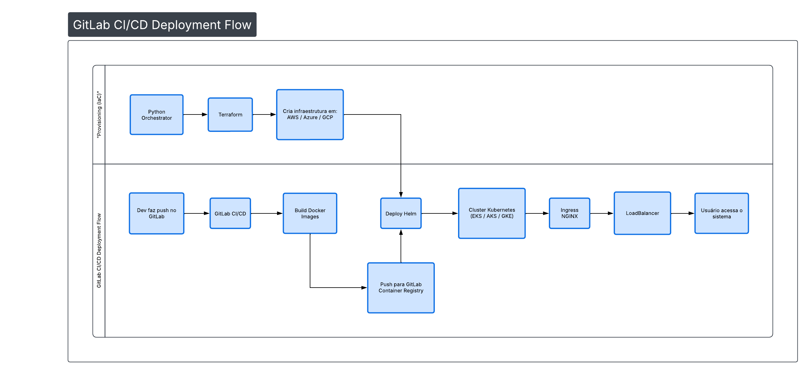

# ☁️ Multi-Cloud E-commerce Orquestrator & Microservices


🎯 Sobre o Projeto

Este projeto é uma prova de conceito (PoC) de uma arquitetura de **Microserviços** altamente escalável, projetada para ser completamente agnóstica de nuvem (Multi-Cloud). O foco principal aqui é garantir automações da melhor forma possível, eliminando o trabalho manual desde a criação da infraestrutura até a atualização contínua da aplicação.

## 🚀 Arquitetura e Automações

A arquitetura foi desenhada em torno de dois grandes fluxos de automação integrados:

**1. Automação de Infraestrutura e Setup Inicial:**
O processo começa executando o orquestrador em Python. Ele é responsável por automatizar a criação de toda a infraestrutura via Terraform na nuvem escolhida (AWS, Azure ou GCP). Com o cluster Kubernetes de pé, o script injeta as variáveis de estado na API do GitLab e aciona a pipeline. A partir daí, o GitLab assume o controle e realiza o deploy do site completo no cluster recém-criado.

**2. Automação de Atualização Contínua (CI/CD):**
A segunda automação é voltada para a evolução do site. Se qualquer atualização for feita no código — por exemplo, a adição de um novo item no microsserviço de catálogo —, basta realizar um `git push`. Esse evento dispara imediatamente a pipeline do GitLab, que constrói as novas versões e atualiza o site em produção de forma 100% automatizada.

<p align="center">
  
</p>

### Detalhamento Técnico do Fluxo:
1. **Orquestração Inteligente:** O script Python local invoca o Terraform para subir o cluster na nuvem escolhida.
2. **Event-Driven API:** Após o provisionamento, o Python atualiza dinamicamente a memória do repositório via GitLab API e aciona o gatilho da pipeline.
3. **Build & Push:** O GitLab CI constrói as imagens Docker dos 5 microsserviços (Frontend, Gateway, Catalog, Cart, Order) e as envia para o Container Registry.
4. **Deploy contínuo:** O Helm aplica os manifestos Kubernetes automaticamente no cluster ativo lendo a variável de estado da nuvem.

## 🔒 DevSecOps & 💰 FinOps (Diferenciais)
* **FinOps (Infracost):** Integrado ao orquestrador Python para calcular a estimativa de custos da infraestrutura *antes* do deploy, evitando surpresas no faturamento.
* **DevSecOps (Trivy):** Análise de vulnerabilidades (CVEs) em contêineres acoplada à esteira de CI/CD, bloqueando o deploy de imagens críticas.

## 🛠️ Como Executar o Orquestrador
O projeto possui uma CLI própria desenvolvida em Python para facilitar a operação de infraestrutura.

```bash
# Para realizar o deploy em uma nuvem específica (aws, azure ou gcp):
python orquestrador.py --nuvem gcp --acao deploy

# Para destruir o ambiente e evitar custos:
python orquestrador.py --nuvem gcp --acao destroy
